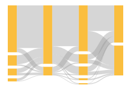

# Data Studio Community Sankey community visualization

Data Studio [community visualizations][community viz] allow you to write custom
JavaScript visualizations for [Google Data Studio][datastudio].



This [sankey] community visualization built with d3.js takes 2 dimensions and a metric. It works best with dimensions of moderate [cardinality] - for example, dimensions with 5-10 unique values.

> Note: The sankey created by Yulan Lin will only accept 2 dimensions, however, this sankey allows you to use up to 20 dimensions and it treats each dimension as a node.

## Webpack usage

This package uses [dscc-gen] for local development. Simply follow the instructions on that page and you're good to go.

## Deployed version

Component ID of the deployed version of this visualization:

```
gs://TBD
```

See the visualization [deployed].

## Authors

Base code written by Yulan Lin. Updated and edited by Steven Hoglund - changes include handling of data, etc.

[community viz]: http://developers.google.com/datastudio/visualization
[datastudio]: https://datastudio.google.com
[sankey]: https://en.wikipedia.org/wiki/Sankey_diagram
[cardinality]: https://en.wikipedia.org/wiki/Cardinality
[dscc-gen]: https://developers.google.com/datastudio/visualization/library
[deployed]: TBD
